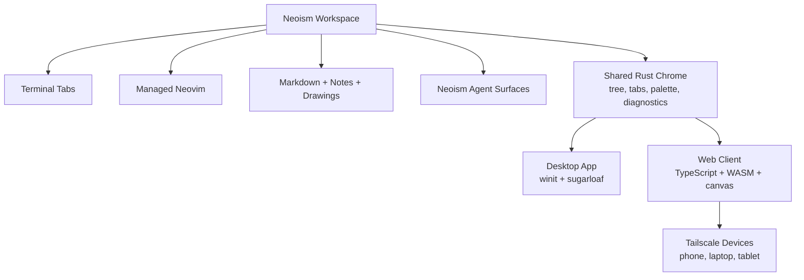
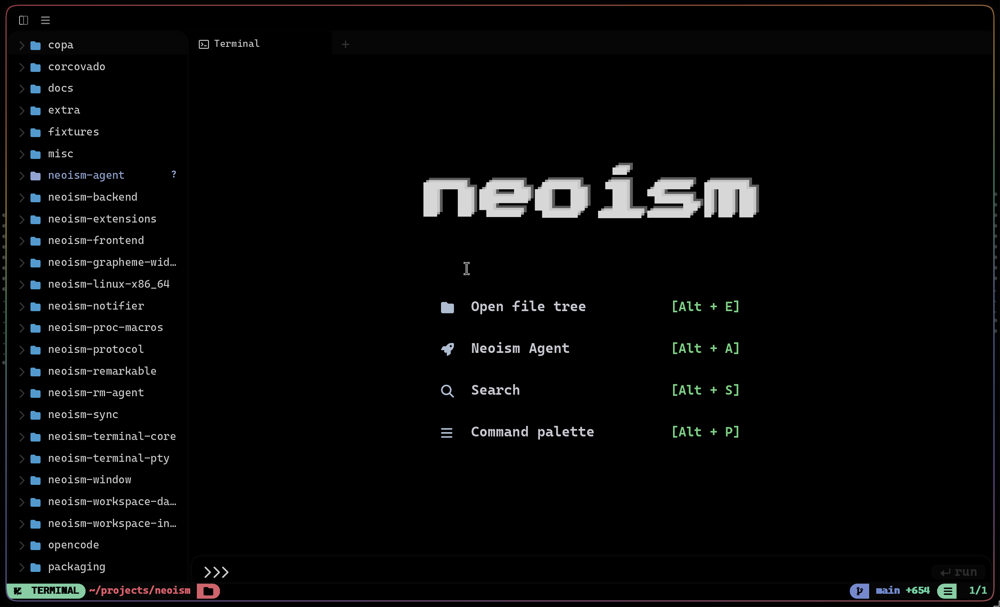
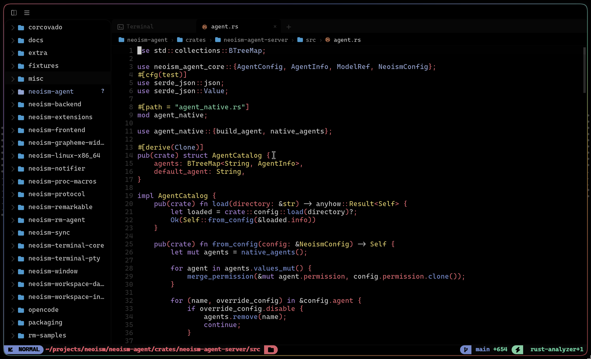
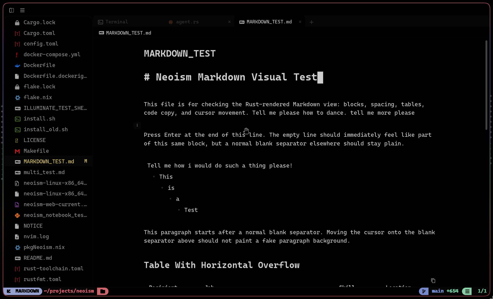
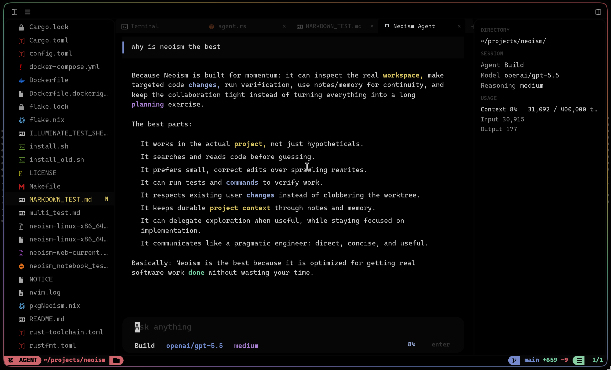
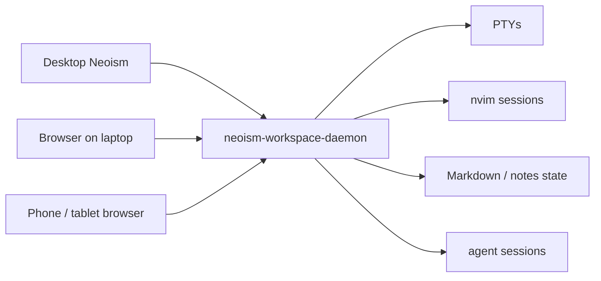
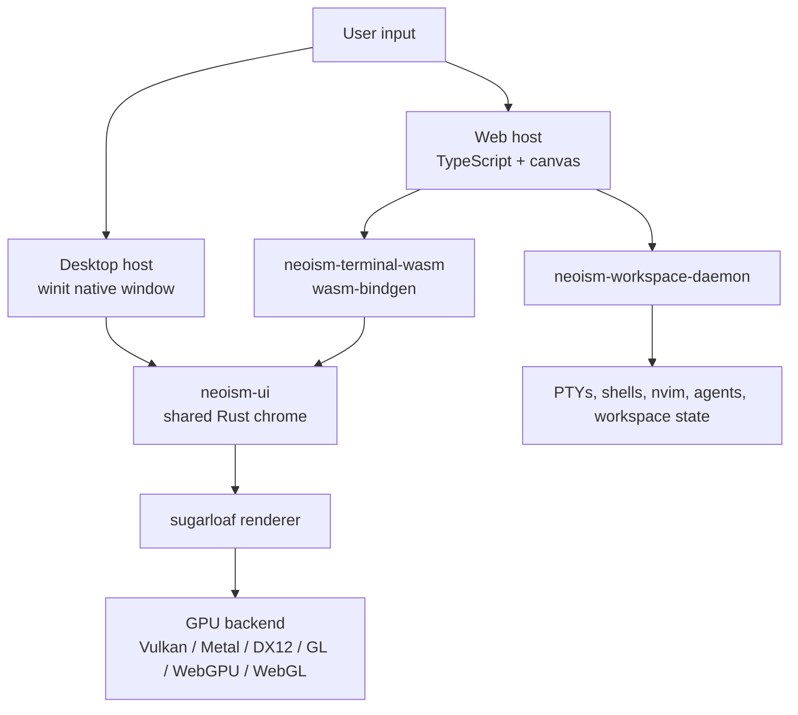

# Neoism

> **Neoism is open source under the [MIT License](LICENSE).** Its terminal core and GPU renderer descend from [Rio](https://github.com/raphamorim/rio) (itself descended from Alacritty); the editor, agent runtime, workspace daemon, sync/CRDT layer, notebooks, drawings, and UI chrome are first-party. See [NOTICE](NOTICE) for full third-party attribution. Prebuilt binaries are also available from [GitHub Releases](https://github.com/parkers0405/neoism/releases).

Neoism is a GPU-rendered terminal-first workspace for code, notes, agents, and multiplayer editing.

It starts from the terminal instead of hiding it. Shells, managed Neovim panes, Markdown notes, drawings, AI agents, file trees, tabs, command palettes, diagnostics, and workspace navigation all live inside one Rust-owned chrome layer. Desktop and web share the same UI policy so a workspace can move between the native app, a browser, a phone, or another laptop over Tailscale without becoming a different product.

Neoism is not an Electron IDE and it is not a normal web terminal. The desktop app owns a native `winit` window and renders through `sugarloaf`; the web client uses TypeScript for the shell but hands the serious terminal/chrome surface to Rust/WASM and browser GPU APIs. The result is closer to a custom editor engine than a pile of widgets.

## What Neoism Can Do

| Area | What It Means |
|---|---|
| Terminal | Real terminal workspaces with GPU-rendered text, smooth scrollback, command palette integration, and shell/agent tabs. |
| Code Editor | Managed Neovim panes inside Neoism chrome, with file tree, buffer tabs, diagnostics, finder, workspace tabs, and smooth editor scrolling. |
| Markdown + Notes | Markdown rendering/editing direction, Neoism Notes integration, CRDT-backed collaboration work, and drawing file surfaces. |
| Neoism Agent | A local agent server with parallel sub-agents, a full tool runtime (edits with snapshots, LSP, search, shell, web, notes), permissions, checkpoints/undo-tree, persistent memory, and terminals/UI for OpenCode, Claude, and Codex. |
| Multiplayer | Shared workspace state across desktop/web devices, collaborative nvim direction, Markdown/notes collaboration direction, and Tailscale-friendly remote control. |
| GPU Web + Desktop | Native GPU rendering on desktop and browser-safe WebGPU/WebGL rendering on web through the same renderer family. |

## Install

### Prebuilt (recommended)

Prebuilt binaries for Linux (x86_64) and macOS (Apple Silicon) are published to the [Releases page](https://github.com/parkers0405/neoism/releases):

```sh
curl -fsSL https://raw.githubusercontent.com/parkers0405/neoism/main/scripts/install.sh | bash
```

This installs `neoism`, `neoism-workspace-daemon`, and `neoism-agent` into `~/.local/bin` (plus the Tree-sitter runtime bundle next to them). First launch bootstraps the rest automatically: terminfo, desktop launcher + icons, default config, and parsers into your data dir. Runtime expectations: `nvim` and `ripgrep` on `PATH`.

Update any time with:

```sh
neoism update
```

If `~/.local/bin` is not on your `PATH`, add:

```sh
export PATH="$HOME/.local/bin:$PATH"
```

### Build from source

```sh
git clone https://github.com/parkers0405/neoism.git neoism
cd neoism
./install.sh
```

The source installer only builds and places files — binaries into `~/.local/bin`, the Tree-sitter runtime bundle into `~/.local/bin/runtime`, and (optionally) the web build. Everything user-facing happens on first launch, same as the prebuilt path.

```sh
./install.sh --help
./install.sh --debug            # debug binaries
./install.sh --skip-web         # skip wasm/Vite web build
./install.sh --refresh-runtime  # rebuild the Tree-sitter bundle
```

## Repository Layout

```text
neoism-frontend/
  desktop/   crate `neoism`                native binary, winit + sugarloaf
  shared/    crate `neoism-ui`             shared UI, layout, panels, policy
  web/       package `@neoism/web`         TypeScript + Vite web client
  wasm/      crate `neoism-terminal-wasm`  Rust terminal/chrome renderer for wasm32

neoism-workspace-daemon/                   local daemon for web/mobile sessions
neoism-protocol/                           JSON protocol shared by client and daemon
neoism-terminal-core/                      terminal parser/grid/effects model
neoism-backend/                            config, terminal integration, fonts, runtime glue
sugarloaf/                                 GPU renderer
teletypewriter/                            terminal text stack pieces
neoism-window/                             window integration helpers
```

## Intro: Terminal-First Workspace

Neoism treats the terminal as the center of the workspace, not a panel bolted onto an IDE.

- Work in normal shells and terminal apps.
- Open managed Neovim panes without leaving the Neoism workspace.
- Use Rust-owned chrome for file tree, buffer tabs, workspace tabs, command palette, modals, diagnostics, finder, and overlays.
- Keep terminal, editor, notes, agents, and workspace navigation in one frame pipeline.
- Share workspace state between desktop and web clients through `neoism-workspace-daemon`.
- Connect from another laptop, phone, or tablet over Tailscale using the web client.
- Build toward multiplayer workflows where nvim, Markdown, and notes can be viewed/edited together instead of being trapped on one screen.



## 1. Terminal



Neoism keeps terminal work fast and first-class.

- GPU-rendered terminal surface through `sugarloaf`.
- Pixel-smooth terminal scrollback with direct physical-pixel tracking.
- Terminal selections and hint selections copy through Neoism instead of leaking escape text into chat TUIs.
- Workspace-aware terminal tabs for shells, project commands, and agents.
- Command palette works from terminal focus, editor focus, or tree focus.
- `:opencode`, `:claude`, and `:codex` open agent terminal tabs in the active workspace.

Useful commands:

```text
Ctrl+P / Cmd+: / Cmd+;  open command palette
:buffers / :ls / :files open buffer picker
:tree / :filetree       open or focus file tree
:opencode               open OpenCode agent tab
:claude                 open Claude agent tab
:codex                  open Codex agent tab
```

## 2. Code Editor



Neoism embeds managed Neovim inside the workspace instead of replacing it.

- Managed nvim runtime bootstrap through the installer.
- Treesitter parser setup and highlight query installation.
- Rust-owned file tree, buffer tabs, command palette, finder, diagnostics, modals, and workspace navigation around nvim.
- Smooth editor scrolling for embedded nvim panes.
- Workspace tabs for switching between shells, editor sessions, notes, and agents.
- `:tabnew`, `:enew`, and `:new` create Rust-owned unnamed editor tabs when no path is provided.

The goal is not to make a fake VS Code clone. The goal is terminal-native editing with enough custom chrome to make project navigation, diagnostics, agents, and notes feel like one workspace.

## 3. Markdown, Neoism Notes, And Drawing



Neoism is also becoming the workspace for project memory.

- Markdown document rendering and editing surfaces, including rendered Mermaid diagrams and syntax-highlighted code fences.
- Neoism Notes integration through the local note vault — tags, backlinks, headings, tasks, and a note graph, all queryable by agents too.
- CRDT-backed Markdown collaboration direction for multiplayer note/editing flows.
- Drawing surfaces such as `.neodraw` for sketches, diagrams, and visual thinking.
- Shared note/workspace context that agents can eventually use as persistent project memory.

This matters because code work is not only code. It is design notes, TODOs, diagrams, bug trails, meeting scraps, agent context, and project memory. Neoism wants those to live next to the terminal/editor instead of being scattered across separate apps.

## 4. Neoism Agent



Neoism treats agents as workspace participants, not separate chat windows — and the architecture backs that up: the agent is not a widget inside the app, it is its own server with a full tool runtime, sub-agent orchestration, an LSP client, and persistent memory.

### Runs as a server, not a sidebar

`neoism-agent` is a standalone binary that runs as a local HTTP server on loopback. The desktop app starts and supervises it automatically (the workspace daemon does the same for web clients), and every surface — desktop pane, browser, phone — is just a client attached to the same server.

- **Sessions outlive windows.** Conversations, tool calls, and results are persisted server-side. Close the window mid-response, reopen later, and the timeline is intact.
- **One session, every device.** The same conversation can be driven from the desktop pane and picked up from the web UI or a phone over the daemon.
- **The workspace is the context.** The agent operates in your actual project: real files, real shell, the same search engines the app uses.

### Sub-agents

The `task` tool spawns real child agent sessions, not simulated ones — each sub-agent gets its own session, model, and permission set, linked to the parent. They run **in parallel in the background** by default: the parent fans work out, keeps going, and gets notified as each child finishes; results can be polled, follow-ups queued, and runaway children cancelled. Built-in sub-agent types include `general` (broad multi-step work) and `explore` (read-only search), and external agents — **Claude Code, Codex, and OpenCode** — can be driven as delegated sub-agents over ACP, installable from inside the app.

### The tool runtime

- **Code edits**: `edit` (string replace), `write`, and `apply_patch` (multi-file patch envelopes). Every mutation captures before/after file snapshots (SHA-256 + content) — these power checkpoints and revert.
- **LSP, both directions**: an `lsp` tool the model can query — hover, go-to-definition, find-references, implementations, call hierarchy, workspace/document symbols, diagnostics — backed by real language servers (rust-analyzer, typescript-language-server, pyright, gopls, clangd, jdtls, and more). And **every edit gets an automatic post-edit diagnostics report**: freshly mutated files are re-checked and any errors the edit introduced are attached to the tool result immediately.
- **Search**: fast custom engines (`ffgrep` content search, `fffind` fuzzy paths, multi-pattern grep) with classic `grep`/`glob` fallbacks.
- **Shell**: foreground `bash` plus detached background jobs with polling — long builds don't block the conversation.
- **Web**: page fetch and web search, single or batched, with optional Firecrawl-backed scraping.
- **Notes**: first-class access to the Neoism Notes vault — read/write/search, tags, backlinks, headings, tasks, graph.
- **Task tracking**: a `todowrite` task list rendered live in the pane; structured questions back to the user; skills loaded from `SKILL.md` files.
- **Artifacts**: oversized tool outputs spill into pageable, searchable artifact stores instead of flooding context.

### Sessions, safety, and memory

- **Permissions engine**: `allow` / `deny` / `ask` rules with glob patterns per tool (e.g. allow `bash` for `cargo *` but ask for everything else); `ask` surfaces an approval card in the UI.
- **Checkpoints and time travel**: `/undo` and `/redo` revert or re-apply at message granularity — including rolling actual files back via the recorded snapshots — with a full undo *tree*, not just a linear stack.
- **Compaction**: long sessions are automatically summarized before they hit the model's context limit; `/compact` triggers it manually.
- **Persistent memory**: a built-in memory MCP maintains a Markdown memory vault (`MEMORY.md` index + typed topic files) the agent recalls across sessions, alongside a notes MCP over your project vault. External MCP servers (HTTP/SSE, with OAuth) plug in the same way.
- **Goals and plan mode**: `/goal` sets a standing objective the session keeps working toward autonomously; plan mode lets the agent inspect and reason with write tools blocked until you approve the plan.

### The pane

The native timeline renders streaming markdown with syntax-highlighted code blocks, **rendered Mermaid diagrams** (click to flip between diagram and raw source), GitHub-style expandable diff cards for edits, live todo lists, collapsible thinking blocks, image/file attachments, and `@`-file mentions. History is virtualized with "load older" pagination so month-long sessions stay fast. Slash commands drive everything:

```text
/model /think /agent /sub-agent /skill /sessions /queue
/mcp /permissions /permit /answer /reject
/compact /undo /redo /goal /abort /new
```

Prefer a third-party UI? `:opencode`, `:claude`, and `:codex` open those CLIs as first-class terminal tabs in the same workspace.

### Providers

The full models.dev catalog with per-model capability handling (reasoning, attachments, tool calls, context limits): Anthropic (API key or OAuth), OpenAI (including the Responses API), GitHub Copilot auth, the opencode gateway, and a Claude Code subscription bridge — plus custom providers.

## Multiplayer And Shared Workspaces

Neoism is built around the idea that a workspace should not be trapped inside one desktop process.

- `neoism-workspace-daemon` owns PTYs, workspace state, pairing tokens, and web/mobile sessions.
- The web client connects over WebSocket using `neoism-protocol`.
- Desktop and web share UI policy through `neoism-ui` so the workspace can feel consistent across devices.
- Tailscale lets another laptop, phone, or tablet connect to the daemon without exposing the workspace to the open internet.
- Collaborative nvim and Markdown/notes workflows are part of the product direction.



## Why The Rendering Layer Is Different

Neoism owns a GPU-rendered frame pipeline.

| Normal App | Neoism |
|---|---|
| Web app renders mostly DOM and CSS. | Web hands a canvas to Rust/WASM and renders terminal/chrome through `sugarloaf`. |
| Electron app ships a browser as the desktop UI. | Desktop owns a native `winit` window and renders custom GPU frames. |
| Terminal often uses `xterm.js`. | Real web terminal path uses `neoism-terminal-wasm` and `sugarloaf`, not `xterm.js`. |
| Native app uses OS widgets or toolkit controls. | Neoism draws its own panels, overlays, tabs, text, and terminal surfaces. |
| Web and desktop duplicate UI logic. | `neoism-ui` is the shared Rust UI and policy layer. |

Desktop can reach native GPU APIs through `sugarloaf` native backends or `wgpu`. Web cannot call Vulkan/Metal/DX12 directly, so it reaches the GPU through browser-safe WebGPU/WebGL via `wgpu`.



## Development

### Working on Neoism while running Neoism

Keep your installed/prod `neoism` open, then run local dev builds through the isolated launcher:

```bash
make dev-isolated
```

For a release-mode local run that still stays isolated from your installed Neoism:

```bash
make dev-isolated-release
```

For just building the release binary without launching it:

```bash
make dev-isolated-build
```

The launcher stores dev-only runtime/config/cache/data under `.tmp/dev-neoism` and uses a separate Cargo target dir at `target/dev-neoism`. This prevents the local checkout from sharing the installed app's `neoism.sock`, daemon auth state, config files, and normal `target/` build locks.

### Desktop

Build/check locally:

```sh
cargo check -p neoism -p neoism-ui
cargo build -p neoism
```

Run from source:

```sh
cargo run -p neoism
```

Wayland-only build:

```sh
cargo build -p neoism --no-default-features --features wayland
```

### Web + Daemon

Start the daemon:

```sh
cargo run -p neoism-workspace-daemon
```

It listens on `127.0.0.1:7878` and serves `/session`. Start the web frontend:

```sh
cd neoism-frontend/web
npm install
npm run dev
```

Vite serves on `http://127.0.0.1:5173` and proxies `/ws` to `ws://127.0.0.1:7878/session` for local dev.

To drive the daemon from a phone or laptop on the same Tailnet, join the host to Tailscale, run the daemon, and point the browser at `ws://<tailscale-ip>:7878/session`.

### Auth Handshake

The wire protocol opens with a `Hello { token, device_label? }` frame from the client. The daemon replies with `HelloAck { accepted, reason? }`. Pairing tokens are minted by the desktop binary and stored in `~/.local/share/neoism/workspaces.json`.

By default, the daemon accepts unauthenticated clients for local legacy mode. To require pairing tokens, set:

```sh
NEOISM_REQUIRE_AUTH=1 cargo run -p neoism-workspace-daemon
```

With the gate on, clients that omit `Hello` or present an unknown token are rejected before reaching the dispatcher.

### Terminal WASM Bundle

The web frontend upgrades to the real sugarloaf renderer when it finds the WASM bundle under `neoism-frontend/web/public/neoism-terminal-wasm/`.

Build it from the repo root:

```sh
rustup target add wasm32-unknown-unknown
cargo install wasm-pack
wasm-pack build --target web \
  -d neoism-frontend/web/public/neoism-terminal-wasm \
  neoism-frontend/wasm
```

Rebuild whenever `neoism-terminal-wasm` or its workspace dependencies change.

### Releasing

```sh
./scripts/release.sh X.Y.Z
```

Bumps the workspace version, tags `vX.Y.Z`, and pushes; the tag triggers the release workflow, which builds the stack and publishes tarballs to the GitHub Releases page. `neoism update` then picks it up everywhere.

## Notes

- The real web terminal path is `ChromeBridge` / `RenderedTerminal` over `sugarloaf`, not `xterm.js`.
- CSS in the web client paints the shell and fallback surfaces; Rust owns the serious terminal/chrome rendering path.
- Desktop and web are intended to converge around shared `neoism-ui` policy instead of becoming two separate products.
- Attribution and license notices for inherited code are preserved in `LICENSE` and `NOTICE`.
